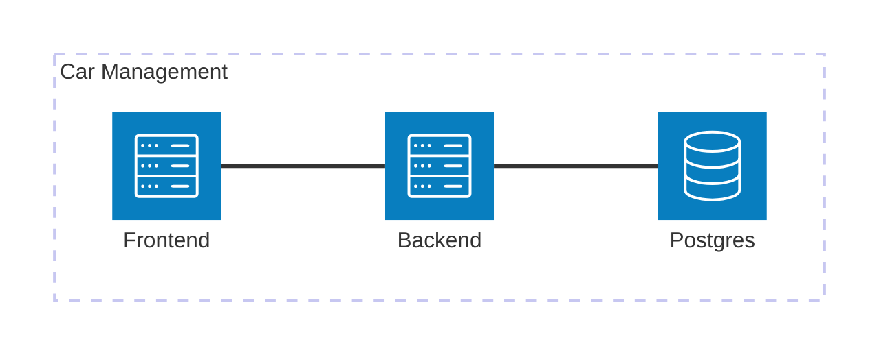

# Car Management

## Description

This repository contains the starting point for the Car Management application development. In order to start working create a fork of this repository and all code changes should be made on that fork.

## Local machine requirements

To run the project you only need to have the following installed in your machine:
- Docker Desktop (4.34 or above) with docker compose.


## Run development environment

We have prepared a development environment to make it easier to start developing on the project. This environment has the following components:
- Frontend application
- Backend application
- Postgres instance

In order to run the development environment you just need to execute the following command in a terminal window:
```
docker compose up
```

When the command finishes the execution you should have an environment like this executing in your local machine:



