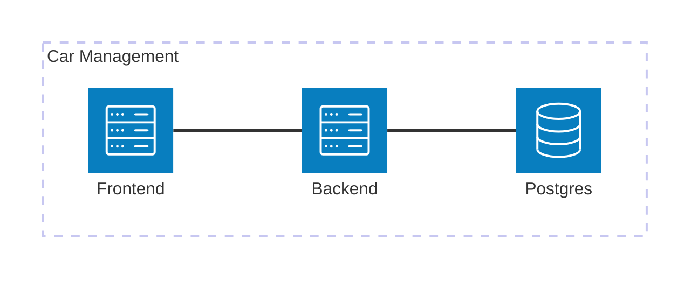

# Car Management

## Description

This repository contains the starting point for the Car Management application development. In order to start working create a fork of this repository and all code changes should be made on that fork.

## Local machine requirements

To run the project you only need to have the following installed in your machine:
- Docker Desktop (4.34 or above) with docker compose.
- Java Development Kit (21)
- Maven
- Node (v20)
- Angular CLI (18)

## Architecture

The Car Management application has three components:
- Frontend application
- Backend application
- Postgres instance

The following diagram represents the basic architecture of the project

The Frontend (car-management-ui folder) and the Backend (car-management-api folder) components are the ones you will need to work on to implement the user stories of the exercice. Please read the Readme files in the folders of the Frontend and Backend. They have instructions to run the development environment and to test your changes.
